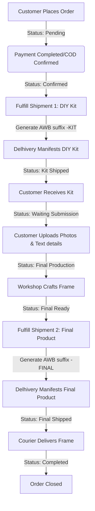

# Make My Memory 🎁

Make My Memory is a premium e-commerce platform for customized keepsakes, personalized gifting, and memory frames, featuring high-fidelity visuals, secure checkout integrations, and a custom **Delhivery Two-Stage Shipping Workflow**.

---

## 🚀 Technology Stack

- **Core**: Next.js 14 (App Router, Server Actions)
- **Styling**: Tailwind CSS
- **Database**: MongoDB (via Mongoose)
- **Payments**: Razorpay & PayPal Staging Integration
- **Courier Logistics**: Delhivery Express Core REST APIs
- **Emails**: Brevo SMTP Relaying (NodeMailer) & Resend APIs
- **Image Cloud**: Cloudinary Storage

---

## 📦 Delhivery Two-Stage Shipping Workflow

To accommodate personalized framing, the ordering process is split into two distinct fulfillment stages linked to the same parent **Order ID** (e.g. `MMM-2026-000001`):



### Shipment Milestones & Suffixes
- **Stage 1 (DIY Kit)**: Dispatched with Order ID suffix `-KIT`.
- **Stage 2 (Final Customised Frame)**: Blocked from manifest creation until Shipment 1 is marked delivered and customer submits asset URLs. Dispatched with suffix `-FINAL`.

### API Routes Architecture
- **Create Kit Manifest**: `POST /api/admin/orders/[id]/shipment1/create`
- **Create Final Product Manifest**: `POST /api/admin/orders/[id]/shipment2/create`
- **Print Shipping Label**: `GET /api/admin/orders/[id]/shipment/label?awb={awb}`
- **Book Courier Pickup**: `POST /api/admin/orders/[id]/shipment/pickup`
- **Submit Customization Assets**: `POST /api/orders/[id]/submit-assets`
- **Delhivery Webhook**: `POST /api/delhivery/webhook` (Processes automated delivery state hooks from Delhivery)

---

## ⚙️ Environment Variables Configuration

Create a `.env.local` file at the root of the project:

| Variable Name | Description | Example / Default Value |
| :--- | :--- | :--- |
| `MONGODB_URI` | MongoDB Connection String | `mongodb+srv://...` |
| `INTERNAL_API_SECRET` | Secure header payload validation token | `758e2f9a79...` |
| `RAZORPAY_KEY_ID` | Razorpay checkout key ID | `rzp_test_...` |
| `RAZORPAY_KEY_SECRET` | Razorpay API verification secret | `your_secret` |
| `NEXT_PUBLIC_RAZORPAY_KEY_ID` | Razorpay public checkout token | `rzp_test_...` |
| `RAZORPAY_WEBHOOK_SECRET` | Webhook security signature secret | `webhook_secret` |
| `PAYPAL_CLIENT_ID` | PayPal sandbox client token | `paypal_id` |
| `PAYPAL_CLIENT_SECRET` | PayPal sandbox transaction secret | `paypal_secret` |
| `PAYPAL_MODE` | PayPal transaction mode | `sandbox` |
| `ADMIN_PASSWORD` | Access credential for admin panel | `admin123456` |
| `ADMIN_EMAIL` | Target email address for admin login | `devanshup416@gmail.com` |
| `SMTP_HOST` | Outgoing SMTP host relay | `smtp-relay.brevo.com` |
| `SMTP_PORT` | SMTP port | `587` |
| `SMTP_USER` | SMTP username | `ad5185001@smtp-brevo.com` |
| `SMTP_PASS` | SMTP access key | `bskUDN6NykzQUsL` |
| `EMAIL_FROM` | Outgoing email sender address | `support@makemymemory.in` |
| `NEXT_PUBLIC_CLOUDINARY_CLOUD_NAME` | Cloudinary resource cloud name | `ky9n8gdw` |
| `CLOUDINARY_API_KEY` | Cloudinary integration key | `289758252937794` |
| `CLOUDINARY_API_SECRET` | Cloudinary credentials secret | `tbVPH...` |
| `RESEND_API_KEY` | Resend API key | `re_Q7eQekbA...` |
| `NEXT_PUBLIC_WHATSAPP_NUMBER` | Contact WhatsApp channel | `918097486800` |
| `DELHIVERY_API_TOKEN` | Delhivery REST Authorization token | `your_token` |
| `DELHIVERY_BASE_URL` | Delhivery API gateway environment | `https://staging-express.delhivery.com` |
| `DELHIVERY_PICKUP_NAME` | Configured pickup warehouse identifier | `MMM Warehouse` |

---

## 🛠️ Getting Started

### 1. Install dependencies
```bash
npm install
```

### 2. Sandbox Verification
Run the shipping test suite to verify configuration credentials:
```bash
node scratch/test_delhivery.js
```

### 3. Start Development Server
```bash
npm run dev
```
Open [http://localhost:3000](http://localhost:3000) in your browser.

---

## 📂 Backup & Deployment Synchronization
The project maintains a secondary repository folder at `/make-my-memory/` for backup. To synchronize modifications:
```powershell
# Copy modified views & api packages
Copy-Item "lib/db/models/Order.ts" "make-my-memory/lib/db/models/Order.ts" -Force
Copy-Item "app/admin/orders/page.tsx" "make-my-memory/app/admin/orders/page.tsx" -Force
Copy-Item "components/orders/OrderHistoryClient.tsx" "make-my-memory/components/orders/OrderHistoryClient.tsx" -Force
```
